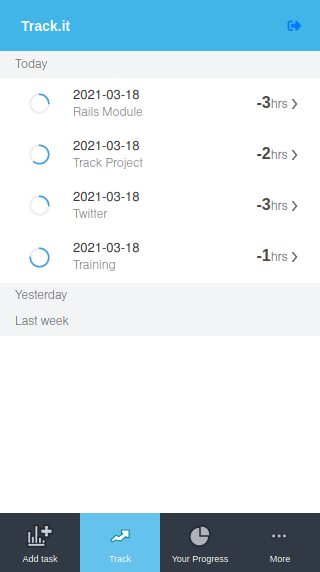
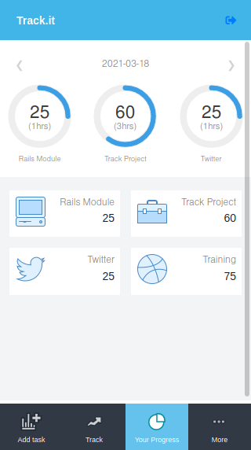
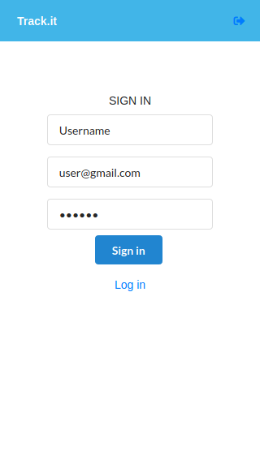
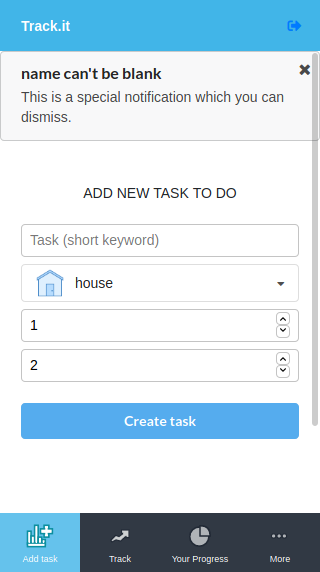

# Tracking app
Tracking your time


[![Contributors][contributors-shield]][contributors-url]
[![Forks][forks-shield]][forks-url]
[![Stargazers][stars-shield]][stars-url]
[![Issues][issues-shield]][issues-url]

<!-- PROJECT LOGO -->
  <h3 align="center">Track</h3>

  <p align="center">
    This project is created with the porpuse of register and tracking the time invested on diferent tasks. The login/logout is implemented using tokens so feel free to use any password it will be encripted.<br /></p>
    <h2 align="center">SCREENSHOTS</h2>

  <p align="center">
      
  &nbsp; &nbsp; &nbsp; &nbsp;
    
  </p>

  <p align="center">
    
  &nbsp; &nbsp; &nbsp; &nbsp;
      
  </p>


<!-- ABOUT THE PROJECT -->
### Features
* Create a new task that will repeat until the expiration day
* Login with secure password and tokens
* Display a list of daily tasks or change the view of tasks per day
* See all tasks per day using the carousel of dates
* The application will show notices when the input data is wrong

## Live Demo
It's deployed [here](https://vigorous-minsky-e3bf16.netlify.app/) on netlify

### Built With
This project was built using these technologies.
* React
* JavaScript
* GitHub
* Redux
* Eslint
* Stylelint
* VScode
* Jest

### Getting Started

To get a local copy up and running follow these simple example steps.

### Prerequisites

 * [Node.js](https://nodejs.org/) is required to install dependencies and run scripts via npm.
 * A modern browser

### Clone
* Clone this repo:
  - Clone with SSH:
  ```
    git@github.com:jessicafarias/tracking_app.git
  ```
  - Clone with HTTPS
  ```
    https://github.com/jessicafarias/tracking_app.git
  ```
  - Clone with GitHub CLI
  ```
    gh repo clone jessicafarias/tracking_app.git
    
 - cd to tracking_app.git


### Setup

Install dependencies:

```
$ npm install
```

Start the local webserver:

```$ npm start``` will open the project at local webserver at http://localhost:3000/ 


## Authors

## 👤 Jessica Michelle Farías Rosado:
Working as a FullStack developer on this project.

 [](https://jessicafarias.github.io/)

 [](https://www.linkedin.com/in/jessica-michelle-farias-rosado/)

 [](mailto:jessica.farias.rosado@gmail.com)
 
 [](https://twitter.com/FariasRosado)


## 👤 Gregoire Vella
A special thanks is expressed to Marc Roy for the design.
This is design will not use as a comercial purpose
- [Work](https://www.behance.net/gallery/13271423/Bodytrackit-An-iOs-app-Branding-UX-and-UI)
- [Grego](https://www.behance.net/gregoirevella)


## 🤝 Contributing

Contributions, issues and feature requests are welcome!

Feel free to check the [issues page](https://github.com/jessicafarias/tracking_app/issues).

## Show your support

Give a :star: if you like this project!


<!-- MARKDOWN LINKS & IMAGES -->
<!-- https://www.markdownguide.org/basic-syntax/#reference-style-links -->
[contributors-shield]: https://img.shields.io/github/contributors/jessicafarias/tracking_app.svg?style=flat-square
[contributors-url]: https://github.com/jessicafarias/tracking_app/graphs/contributors
[forks-shield]: https://img.shields.io/github/forks/jessicafarias/tracking_app.svg?style=flat-square
[forks-url]: https://github.com/jessicafarias/tracking_app/network/members
[stars-shield]: https://img.shields.io/github/stars/jessicafarias/tracking_app.svg?style=flat-square
[stars-url]: https://github.com/jessicafarias/tracking_app/stargazers
[issues-shield]: https://img.shields.io/github/issues/jessicafarias/tracking_app.svg?style=flat-square
[issues-url]: https://github.com/jessicafarias/tracking_app/issues

## 📝 License

This project is [MIT](https://opensource.org/licenses/MIT) licensed.

